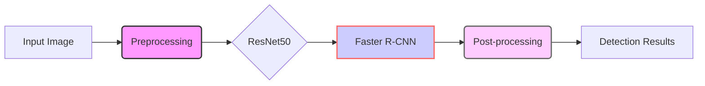

# Algorithm Design Notes

## Comparison of Detection Methods

### 1. Analysis of Different Architectures

#### YOLOv7
##### Key Features:
- Single-stage detector
- End-to-end training
- Direct prediction of bounding boxes and class probabilities
- Optimized for real-time detection (100+ FPS on GPU)

##### Advantages:
- High speed for real-time applications
- Good balance between accuracy and speed (approx. 10% AP improvement over YOLOv5)
- Flexible training and dynamic resolution adjustment

##### Limitations:
- Lower accuracy for microscopic object detection
- High memory consumption (model size around 70MB)

#### OpenCV (Traditional Methods)
##### Key Features:
- Non-deep learning methods (Haar cascades, HOG+SVM, template matching)
- Lightweight computation
- CPU-based processing

##### Advantages:
- Low resource requirements (no GPU needed)
- Simple API, suitable for rapid prototyping
- Can directly use pre-trained models

##### Limitations:
- Limited accuracy in complex scenarios
- Single functionality
- Poor scalability

#### Faster R-CNN based on ResNet50
##### Key Features:
- Two-stage detector
- ResNet50 backbone for feature extraction
- Region Proposal Network (RPN)
- Designed for high accuracy

##### Advantages:
- Excellent accuracy, especially for small object detection
- Strong feature extraction capability
- Good interpretability

##### Limitations:
- High computational cost (approx. 200ms per image)
- Large memory footprint (approx. 200MB)
- Requires GPU for efficient processing

## System Integration Strategy

### 1. Implementation Goals
- Combine the advantages of multiple methods
- Balance performance and resource consumption
- Achieve flexible deployment options

### 2. Architecture Design


**Preprocessing Stage Enhancement:**
In the latest version, the preprocessing stage has been significantly enhanced to address the challenges of clustered colonies and improve detection accuracy, especially in lower resolution images. This enhancement integrates Canny edge detection and Watershed segmentation algorithms into the preprocessing pipeline.

- **Canny Edge Detection**: Applied to precisely identify colony boundaries by detecting edges in the grayscale image after Gaussian blurring. This step is crucial for delineating the contours of individual colonies.

- **Watershed Segmentation**: Employed to effectively separate closely clustered or touching colonies. By using a distance transform on the eroded Canny edges and marker-based watershed segmentation, this algorithm ensures that individual colonies within a cluster are identified and segmented as distinct entities, resolving the issue of 'large circles' around colony clusters.

   
This refined preprocessing pipeline, incorporating Canny and Watershed, aims to significantly improve the accuracy and robustness of colony detection, particularly in challenging image conditions.

```mermaid
graph LR
    A[Input Image] --> B(Preprocessing);
    B --> C{ResNet50};
    C --> D[Faster R-CNN];
    D --> E(Post-processing);
    E --> F[Detection Results];
    style B fill:#f9f,stroke:#333,stroke-width:2px
    style D fill:#ccf,stroke:#f66,stroke-width:2px
    style E fill:#fcf,stroke:#666,stroke-width:2px
    subgraph Preprocessing Stage
      B1[Grayscale Conversion] --> B2[Gaussian Blur]
      B2 --> B3[Canny Edge Detection]
      B3 --> B4[Erosion (Edges)]
      B4 --> B5[Distance Transform]
      B5 --> B6[Thresholding (Markers)]
      B6 --> B7[Watershed Segmentation]
      B7 --> B
      style B1 fill:#eee,stroke:#999,stroke-dasharray:5,stroke-width:1px
      style B2 fill:#eee,stroke:#999,stroke-dasharray:5,stroke-width:1px
      style B3 fill:#eee,stroke:#999,stroke-dasharray:5,stroke-width:1px
      style B4 fill:#eee,stroke:#999,stroke-dasharray:5,stroke-width:1px
      style B5 fill:#eee,stroke:#999,stroke-dasharray:5,stroke-width:1px
      style B6 fill:#eee,stroke:#999,stroke-dasharray:5,stroke-width:1px
      style B7 fill:#eee,stroke:#999,stroke-dasharray:5,stroke-width:1px
    end
```

```plaintext
+-------------------+     +------------------------+     +-------------------+     +-------------------+
|  Input Image      |     | Preprocessing          |     |  ResNet50         |     | Faster R-CNN      |
|                   | →   | (Grayscale, Gaussian   | →   | (Base Feature     | →   | (Object Detection)|
|                   |     | Blur, Canny, Watershed)|     |  Extraction)      |     |                   |
+-------------------+     +------------------------+     +-------------------+     +-------------------+
```
# Algorithm Design Notes

## Comparison of Detection Methods

### 1. Analysis of Different Architectures

#### YOLOv7
##### Key Features:
- Single-stage detector
- End-to-end training
- Direct prediction of bounding boxes and class probabilities
- Optimized for real-time detection (100+ FPS on GPU)

##### Advantages:
- High speed for real-time applications
- Good balance between accuracy and speed (approx. 10% AP improvement over YOLOv5)
- Flexible training and dynamic resolution adjustment

##### Limitations:
- Lower accuracy for microscopic object detection
- High memory consumption (model size around 70MB)

#### OpenCV (Traditional Methods)
##### Key Features:
- Non-deep learning methods (Haar cascades, HOG+SVM, template matching)
- Lightweight computation
- CPU-based processing

##### Advantages:
- Low resource requirements (no GPU needed)
- Simple API, suitable for rapid prototyping
- Can directly use pre-trained models

##### Limitations:
- Limited accuracy in complex scenarios
- Single functionality
- Poor scalability

#### Faster R-CNN based on ResNet50
##### Key Features:
- Two-stage detector
- ResNet50 backbone for feature extraction
- Region Proposal Network (RPN)
- Designed for high accuracy

##### Advantages:
- Excellent accuracy, especially for small object detection
- Strong feature extraction capability
- Good interpretability

##### Limitations:
- High computational cost (approx. 200ms per image)
- Large memory footprint (approx. 200MB)
- Requires GPU for efficient processing

## System Integration Strategy

### 1. Implementation Goals
- Combine the advantages of multiple methods
- Balance performance and resource consumption
- Achieve flexible deployment options

### 2. Architecture Design


**Preprocessing Stage Enhancement:**
In the latest version, the preprocessing stage has been enhanced by integrating Canny edge detection and Watershed segmentation algorithms. 

- **Canny Edge Detection**: Applied to identify colony boundaries more effectively.
- **Watershed Segmentation**: Used to separate closely clustered colonies, improving individual colony detection accuracy.
   
This refined preprocessing pipeline aims to improve the accuracy of colony detection, especially in challenging images with clustered or low-resolution colonies.

```plaintext
+-------------------+     +-------------------+     +-------------------+     +-------------------+
|  Input Image      |     | Preprocessing     |     |  ResNet50         |     | Faster R-CNN      |
|                   | →   | (Canny, Watershed)| →   | (Base Feature     | →   | (Object Detection)|
|                   |     |                   |     |  Extraction)      |     |                   |
+-------------------+     +-------------------+     +-------------------+     +-------------------+
```
# Algorithm Design Notes

## Comparison of Detection Methods

### 1. Analysis of Different Architectures

#### YOLOv7
##### Key Features:
- Single-stage detector
- End-to-end training
- Direct prediction of bounding boxes and class probabilities
- Optimized for real-time detection (100+ FPS on GPU)

##### Advantages:
- High speed for real-time applications
- Good balance between accuracy and speed (approx. 10% AP improvement over YOLOv5)
- Flexible training and dynamic resolution adjustment

##### Limitations:
- Lower accuracy for microscopic object detection
- High memory consumption (model size around 70MB)

#### OpenCV (Traditional Methods)
##### Key Features:
- Non-deep learning methods (Haar cascades, HOG+SVM, template matching)
- Lightweight computation
- CPU-based processing

##### Advantages:
- Low resource requirements (no GPU needed)
- Simple API, suitable for rapid prototyping
- Can directly use pre-trained models

##### Limitations:
- Limited accuracy in complex scenarios
- Single functionality
- Poor scalability

#### Faster R-CNN based on ResNet50
##### Key Features:
- Two-stage detector
- ResNet50 backbone for feature extraction
- Region Proposal Network (RPN)
- Designed for high accuracy

##### Advantages:
- Excellent accuracy, especially for small object detection
- Strong feature extraction capability
- Good interpretability

##### Limitations:
- High computational cost (approx. 200ms per image)
- Large memory footprint (approx. 200MB)
- Requires GPU for efficient processing

## System Integration Strategy

### 1. Implementation Goals
- Combine the advantages of multiple methods
- Balance performance and resource consumption
- Achieve flexible deployment options

### 2. Architecture Design
```plaintext
+-------------------+     +-------------------+     +-------------------+
|  ResNet50         |     | Faster R-CNN      |     | OpenCV            |
| (Base Feature     | →   | (Object Detection)| →   | (Post-processing  |
|  Extraction)      |     | Region Proposal   |     |  Optimization)    |
| Deep Residual     |     | Network           |     | Traditional Image |
| Learning          |     |                   |     | Processing        |
+-------------------+     +-------------------+     +-------------------+
```

### 3. Technical Implementation
1. **Data Preprocessing Pipeline**
   ```python
   def preprocess_pipeline(image):
       # UV spectrum enhancement
       uv_enhanced = enhance_uv_spectrum(image)
       
       # Multispectral fusion
       fused = spectral_fusion(image, uv_enhanced)
       
       # Image normalization
       normalized = normalize_image(fused)
       
       return normalized
   ```

2. **Optimization Strategies**
   - Model compression: quantization, pruning
   - Feature fusion: multi-scale feature pyramid
   - Attention mechanism: CBAM module integration

### 4. Deployment and Optimization
1. **Deployment Options**
   - ONNX format export
   - TensorRT acceleration
   - OpenVINO support

2. **Performance Optimization**
   - Batch processing parallelization
   - GPU memory optimization
   - CPU task allocation

## Integration of Patented Technologies

### 1. Core Technical Components
#### Multispectral Image Fusion
- Supports ultraviolet/infrared imaging
- Enhances colony edge detection
- Multimodal fusion at the feature level

#### Dynamic Feature Selection
- Introduces CBAM attention mechanism
- Optimizes feature extraction process
- Enhances discrimination against complex backgrounds

#### Small Sample Optimization Strategy
- Transfer learning application
- Online Hard Example Mining (OHEM)
- Enhances model generalization ability

## New Version Notes
The new version (app/) uses PySide6 and the PyOneDark theme, providing a more modern user interface and improved performance.

## References and Acknowledgements

### Core Algorithm References

#### ResNet
**Paper**: "Deep Residual Learning for Image Recognition"
```bibtex
@article{he2015deep,
  title={Deep Residual Learning for Image Recognition},
  author={He, Kaiming and Zhang, Xiangyu and Ren, Shaoqing and Sun, Jian},
  journal={arXiv preprint arXiv:1512.03385},
  year={2015}
}
```

#### Faster R-CNN
**Paper**: "Faster R-CNN: Towards Real-Time Object Detection with Region Proposal Networks"
```bibtex
@article{ren2015faster,
  title={Faster R-CNN: Towards Real-Time Object Detection with Region Proposal Networks},
  author={Ren, Shaoqing and He, Kaiming and Girshick, Ross and Sun, Jian},
  journal={arXiv preprint arXiv:1506.01497},
  year={2015}
}
```

### Acknowledgements

This project builds upon the pioneering work of many researchers and institutions:

- **Microsoft Research Asia (MSRA) Team**:
  - Kaiming He
  - Xiangyu Zhang
  - Shaoqing Ren
  - Jian Sun

- **Fast/Faster R-CNN Contributors**:
  - Ross Girshick (Microsoft Research)
  - Original Fast R-CNN team

Special thanks to all open-source contributors whose publicly shared implementations and improvements have provided valuable resources for research and development in the fields of computer vision and object detection.
