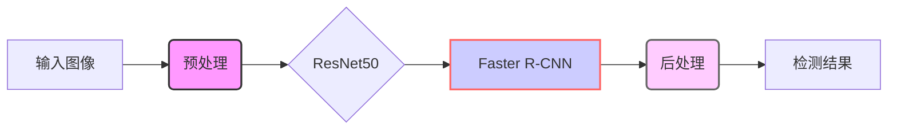

# 算法设计笔记

## 检测方法对比

### 1. 不同架构分析

#### YOLOv7
##### 核心特点：
- 单阶段检测器
- 端到端训练
- 直接预测边界框和类别概率
- 针对实时检测优化（GPU上可达100+ FPS）

##### 优势：
- 实时应用的高速性能
- 精度和速度的良好平衡（相比YOLOv5提升约10% AP）
- 灵活的训练和动态分辨率调整

##### 局限性：
- 显微目标检测精度较低
- 内存消耗大（模型约70MB）

#### OpenCV（传统方法）
##### 核心特点：
- 非深度学习方法（Haar级联、HOG+SVM、模板匹配）
- 轻量级计算
- 基于CPU处理

##### 优势：
- 低资源需求（无需GPU）
- 简单API，适合快速原型开发
- 可直接使用预训练模型

##### 局限性：
- 复杂场景下精度有限
- 功能单一
- 扩展性差

#### 基于ResNet50的Faster R-CNN
##### 核心特点：
- 两阶段检测器
- ResNet50主干网络特征提取
- 区域建议网络（RPN）
- 设计注重高精度

##### 优势：
- 优秀的精度，特别是小目标检测
- 强大的特征提取能力
- 良好的可解释性

##### 局限性：
- 计算成本高（每图约200ms）
- 内存占用大（约200MB）
- 需要GPU支持高效处理

## 系统集成策略

### 1. 实现目标
- 结合多种方法的优势
- 平衡性能和资源消耗
- 实现灵活的部署选项

### 2. 架构设计


**预处理阶段增强：**
在最新版本中，预处理阶段通过集成 Canny 边缘检测和 Watershed 分割算法得到了增强。

- **Canny 边缘检测**：应用 Canny 边缘检测可以更有效地识别菌落边界。
- **Watershed 分割**：Watershed 分割用于分离紧密聚集的菌落，从而提高单个菌落的检测精度。

改进后的预处理流程旨在提高菌落检测的准确性，尤其是在聚 clusters 或低分辨率图像等具有挑战性的图像中。

```plaintext
+-------------------+     +-------------------+     +-------------------+     +-------------------+
|  输入图像        |     | 预处理           |     |  ResNet50         |     | Faster R-CNN      |
|                   | →   | (Canny, Watershed)| →   | （基础特征提取）   | →   | （目标检测）      |
|                   |     |                   |     |                   |     |                   |
+-------------------+     +-------------------+     +-------------------+     +-------------------+
```
# 算法设计笔记

## 检测方法对比

### 1. 不同架构分析

#### YOLOv7
##### 核心特点：
- 单阶段检测器
- 端到端训练
- 直接预测边界框和类别概率
- 针对实时检测优化（GPU上可达100+ FPS）

##### 优势：
- 实时应用的高速性能
- 精度和速度的良好平衡（相比YOLOv5提升约10% AP）
- 灵活的训练和动态分辨率调整

##### 局限性：
- 显微目标检测精度较低
- 内存消耗大（模型约70MB）

#### OpenCV（传统方法）
##### 核心特点：
- 非深度学习方法（Haar级联、HOG+SVM、模板匹配）
- 轻量级计算
- 基于CPU处理

##### 优势：
- 低资源需求（无需GPU）
- 简单API，适合快速原型开发
- 可直接使用预训练模型

##### 局限性：
- 复杂场景下精度有限
- 功能单一
- 扩展性差

#### 基于ResNet50的Faster R-CNN
##### 核心特点：
- 两阶段检测器
- ResNet50主干网络特征提取
- 区域建议网络（RPN）
- 设计注重高精度

##### 优势：
- 优秀的精度，特别是小目标检测
- 强大的特征提取能力
- 良好的可解释性

##### 局限性：
- 计算成本高（每图约200ms）
- 内存占用大（约200MB）
- 需要GPU支持高效处理

## 系统集成策略

### 1. 实现目标
- 结合多种方法的优势
- 平衡性能和资源消耗
- 实现灵活的部署选项

### 2. 架构设计


**预处理阶段增强：**
在最新版本中，预处理阶段已得到显著增强，旨在解决菌落聚 clusters 的挑战，并提高检测精度，尤其是在较低分辨率的图像中。此增强功能将 Canny 边缘检测和 Watershed 分割算法集成到预处理流程中。

- **Canny 边缘检测**：应用 Canny 边缘检测通过检测高斯模糊后灰度图像中的边缘来精确识别菌落边界。此步骤对于描绘各个菌落的轮廓至关重要。

- **Watershed 分割**：采用 Watershed 分割可有效分离紧密聚 clusters 或接触的菌落。通过对腐蚀后的 Canny 边缘使用距离变换和基于标记的 Watershed 分割，此算法可确保 clusters 内的各个菌落被识别和分割为不同的实体，从而解决菌落 clusters 周围“大圈圈”的问题。

   
这种改进的预处理流程结合了 Canny 和 Watershed 算法，旨在显著提高菌落检测的准确性和鲁棒性，尤其是在具有挑战性的图像条件下。

```mermaid
graph LR
    A[输入图像] --> B(预处理);
    B --> C{ResNet50};
    C --> D[Faster R-CNN];
    D --> E(后处理);
    E --> F[检测结果];
    style B fill:#f9f,stroke:#333,stroke-width:2px
    style D fill:#ccf,stroke:#f66,stroke-width:2px
    style E fill:#fcf,stroke:#666,stroke-width:2px
    subgraph 预处理阶段
      B1[灰度转换] --> B2[高斯模糊]
      B2 --> B3[Canny 边缘检测]
      B3 --> B4[腐蚀 (边缘)]
      B4 --> B5[距离变换]
      B5 --> B6[阈值处理 (标记)]
      B6 --> B7[Watershed 分割]
      B7 --> B
      style B1 fill:#eee,stroke:#999,stroke-dasharray:5,stroke-width:1px
      style B2 fill:#eee,stroke:#999,stroke-dasharray:5,stroke-width:1px
      style B3 fill:#eee,stroke:#999,stroke-dasharray:5,stroke-width:1px
      style B4 fill:#eee,stroke:#999,stroke-dasharray:5,stroke-width:1px
      style B5 fill:#eee,stroke:#999,stroke-dasharray:5,stroke-width:1px
      style B6 fill:#eee,stroke:#999,stroke-dasharray:5,stroke-width:1px
      style B7 fill:#eee,stroke:#999,stroke-dasharray:5,stroke-width:1px
    end
```

```plaintext
+-------------------+     +------------------------+     +-------------------+     +-------------------+
|  输入图像        |     | 预处理                 |     |  ResNet50         |     | Faster R-CNN      |
|                   | →   | (灰度、高斯模糊、Canny、 | →   | （基础特征提取）   | →   | （目标检测）      |
|                   |     | Watershed)             |     |                   |     |                   |
+-------------------+     +------------------------+     +-------------------+     +-------------------+
```

### 3. 技术实现
1. **数据预处理流程**
   ```python
   def preprocess_pipeline(image):
       # UV光谱增强
       uv_enhanced = enhance_uv_spectrum(image)
       
       # 多光谱融合
       fused = spectral_fusion(image, uv_enhanced)
       
       # 图像归一化
       normalized = normalize_image(fused)
       
       return normalized
   ```

2. **优化策略**
   - 模型压缩：量化、剪枝
   - 特征融合：多尺度特征金字塔
   - 注意力机制：CBAM模块集成

### 4. 部署和优化
1. **部署方案**
   - ONNX格式导出
   - TensorRT加速
   - OpenVINO支持

2. **性能优化**
   - 批处理并行化
   - GPU显存优化
   - CPU任务分配

## 专利技术整合

### 1. 核心技术组件
#### 多光谱图像融合
- 支持紫外/红外光成像
- 增强菌落边缘检测能力
- 特征层面的多模态融合

#### 动态特征选择
- 引入CBAM注意力机制
- 优化特征提取过程
- 增强对复杂背景的分辨能力

#### 小样本优化策略
- 迁移学习应用
- 在线难例挖掘（OHEM）
- 增强模型泛化能力

## 新版本说明
新版本 (app/) 使用 PySide6 和 PyOneDark 主题，提供更现代化的用户界面和更好的性能。

## 参考文献与致谢

### 核心算法参考

#### ResNet
**论文**：《Deep Residual Learning for Image Recognition》
```bibtex
@article{he2015deep,
  title={Deep Residual Learning for Image Recognition},
  author={He, Kaiming and Zhang, Xiangyu and Ren, Shaoqing and Sun, Jian},
  journal={arXiv preprint arXiv:1512.03385},
  year={2015}
}
```

#### Faster R-CNN
**论文**：《Faster R-CNN: Towards Real-Time Object Detection with Region Proposal Networks》
```bibtex
@article{ren2015faster,
  title={Faster R-CNN: Towards Real-Time Object Detection with Region Proposal Networks},
  author={Ren, Shaoqing and He, Kaiming and Girshick, Ross and Sun, Jian},
  journal={arXiv preprint arXiv:1506.01497},
  year={2015}
}
```

### 致谢

本项目建立在多位研究者和机构的开创性工作基础之上：

- **微软亚洲研究院（MSRA）团队**：
  - 何恺明
  - 张翔雨
  - 任少卿
  - 孙剑

- **Fast/Faster R-CNN贡献者**：
  - Ross Girshick（微软研究院）
  - 原始Fast R-CNN团队

特别感谢所有开源贡献者，他们公开分享的实现和改进为计算机视觉与目标检测领域的研究与发展提供了宝贵资源。
