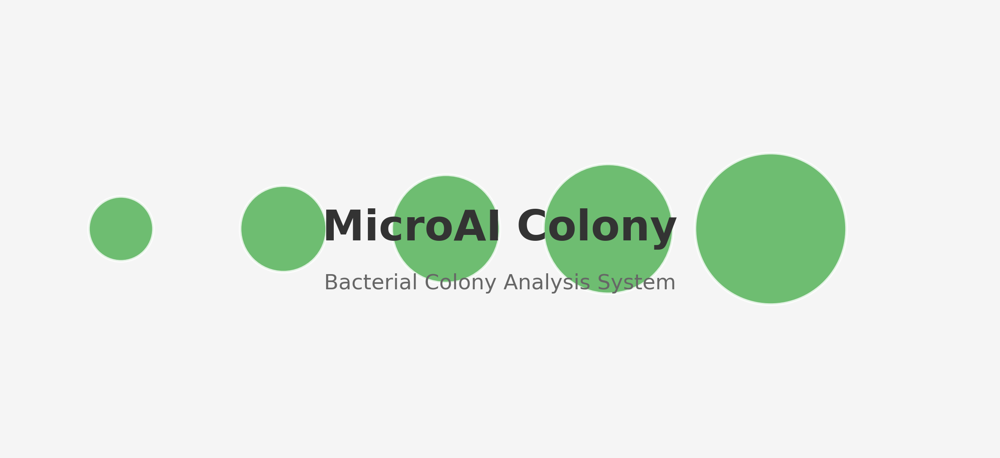

# Colony Detection and Analysis System



## Project Overview

An open source colony detection and analysis system based on deep learning technology for high-precision colony counting and morphology analysis.

Current implementations:
1. `apps/app/main.py` - PyQt6-based prototype for feature validation
2. `MICROAI-COLONY/` - Main development direction, modern Flask-based implementation

## Quick Start

```bash
# Create virtual environment
python -m venv venv

# Activate environment
# Windows
venv\Scripts\activate
# Linux/macOS
source venv/bin/activate

# Install dependencies
pip install -r requirements.txt

# Launch system
python MICROAI-COLONY/app.py
```

## Documentation

- [Technical Docs](docs/technical/)
- [Model Comparisons](docs/model_comparisons/)  
- [Performance Reports](docs/performance_reports/)
- [User Guides](docs/guides/)
- [Development Docs](docs/development/)

## Key Features

- High-precision colony detection
- Multiple model support
- Batch processing capability
- Result visualization

## Contact Us

- Issues: GitHub Issues
- Discussions: GitHub Discussions  
- Email: colony@example.com

## License

[AGPL-3.0](LICENSE)
