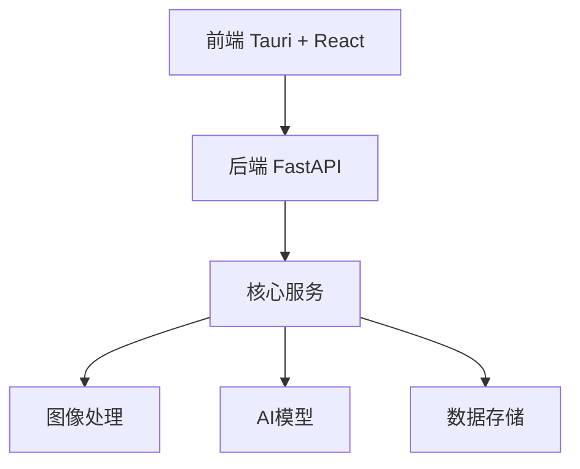

# 开发指南

## 目录

1. [项目架构](#项目架构)
2. [开发环境配置](#开发环境配置)
3. [编码规范](#编码规范)
4. [项目结构](#项目结构)
5. [工作流程](#工作流程)

## 项目架构

### 整体架构



### 前端架构

- Tauri: 跨平台应用框架
- React: UI开发框架
- 三层结构:
  1. 顶部: 快捷操作和参数设置
  2. 中部: 主要内容区域
  3. 底部: 导航栏（相机按钮居中）

### 后端架构

- FastAPI: RESTful API服务
- 模块化设计:
  - 核心服务层
  - AI模型适配层
  - 数据访问层

## 开发环境配置

### 系统要求

- Python 3.8+
- Node.js 16+
- Rust (Tauri依赖)

### 环境搭建

1. Python环境
```bash
python -m venv venv
source venv/bin/activate  # Linux/macOS
# 或
.\venv\Scripts\activate  # Windows
pip install -r requirements.txt
```

2. Node.js环境
```bash
cd frontend
npm install
```

3. 数据库
```bash
# SQLite配置在backend/config/database.py中
```

## 编码规范

### Python代码规范

- 遵循PEP 8规范
- 使用类型注解
- 文档字符串使用Google风格

### React/TypeScript代码规范

- 使用ESLint和Prettier
- 组件使用Function Component
- 使用TypeScript类型定义
- 遵循React Hooks规范

## 项目结构

### 前端结构
```
frontend/
├── src/
│   ├── components/         # 可复用组件
│   │   ├── Camera/        # 相机组件
│   │   ├── LevelMeter/   # 水平仪组件
│   │   └── shared/       # 通用组件
│   ├── layouts/          # 布局组件
│   ├── pages/           # 页面组件
│   ├── services/        # API服务
│   ├── utils/          # 工具函数
│   └── types/          # TypeScript类型定义
```

### 后端结构
```
backend/
├── core/               # 核心功能实现
│   ├── image/         # 图像处理
│   ├── models/        # AI模型
│   └── analysis/      # 分析服务
├── api/               # API定义
├── services/          # 业务服务
└── utils/            # 工具函数
```

## 工作流程

1. 特性开发流程
   - 创建特性分支
   - 开发并测试
   - 提交Pull Request
   - 代码审查
   - 合并到主分支

2. 版本发布流程
   - 特性冻结
   - 全面测试
   - 文档更新
   - 版本标记
   - 发布构建

3. 文档维护
   - 及时更新API文档
   - 维护开发文档
   - 更新用户指南

## 注意事项

1. 代码提交
   - 提交前进行lint检查
   - 遵循提交信息规范
   - 确保测试用例通过

2. 安全事项
   - 不在代码中硬编码敏感信息
   - API请求使用适当的认证
   - 遵循安全最佳实践

3. 性能考虑
   - 图像处理优化
   - 资源合理使用
   - 避免内存泄漏

## 常见问题

1. 开发环境问题
   - 环境配置问题
   - 依赖冲突解决
   - 跨平台兼容性

2. 编译部署问题
   - 打包注意事项
   - 部署检查清单
   - 常见错误处理

## 参考资源

- [Tauri官方文档](https://tauri.app/)
- [FastAPI文档](https://fastapi.tiangolo.com/)
- [React文档](https://react.dev/)
- [TypeScript文档](https://www.typescriptlang.org/)
