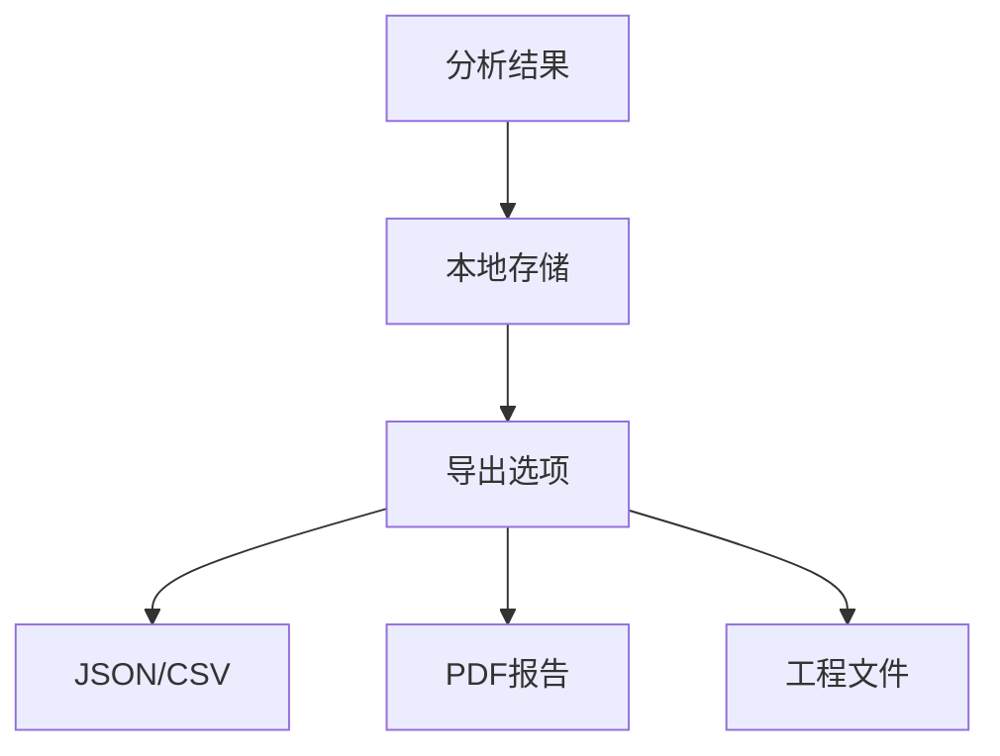
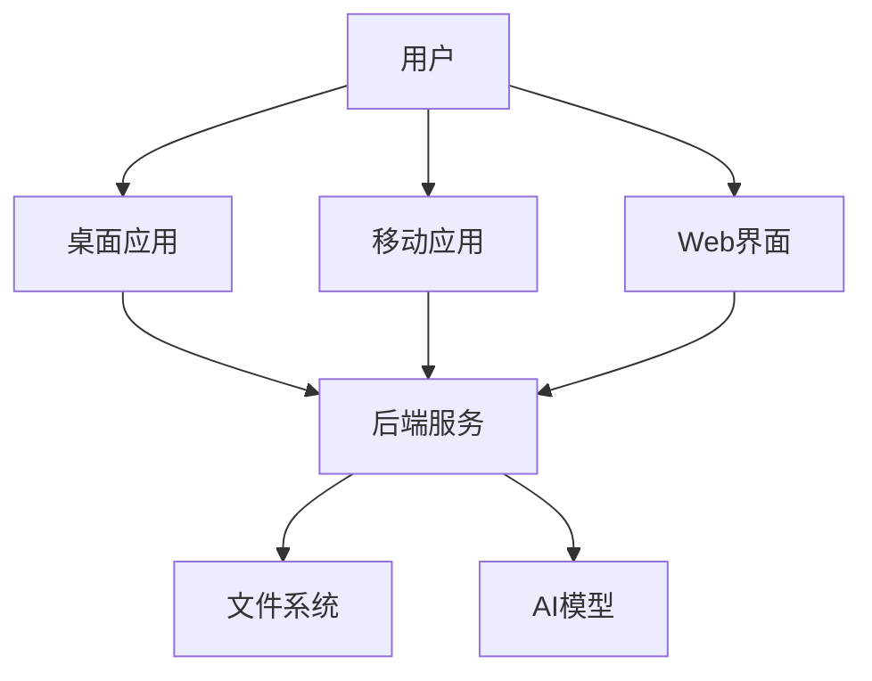

# 项目结构说明

## 整体架构

```
colony-next/
├── frontend/                    # 前端应用(Tauri + React)
│   ├── src/                    # 源代码
│   │   ├── components/         # UI组件
│   │   ├── layouts/           # 布局组件
│   │   ├── pages/            # 页面组件
│   │   ├── services/         # API服务
│   │   └── utils/           # 工具函数
│   ├── src-tauri/            # Tauri配置和原生代码
│   └── public/              # 静态资源
├── backend/                  # 后端服务(FastAPI)
│   ├── core/               # 核心功能
│   │   ├── image_processor.py  # 图像处理
│   │   ├── model_manager.py   # AI模型管理
│   │   ├── camera_manager.py  # 相机控制
│   │   └── websocket_manager.py # WebSocket管理
│   ├── api/                # API路由
│   └── services/          # 业务服务
└── docs/                  # 项目文档
    ├── development/      # 开发文档
    ├── api/             # API文档
    └── guides/         # 用户指南
```

## 模块说明

### 前端模块

1. **组件 (components/)**
   - 可复用UI组件
   - 遵循原子设计原则
   - 统一的样式和交互

2. **布局 (layouts/)**
   - 页面整体布局
   - 导航组件
   - 响应式设计

3. **页面 (pages/)**
   - 主页
   - 分析页面
   - 历史记录
   - 设置页面

4. **服务 (services/)**
   - API调用
   - WebSocket连接
   - 状态管理

### 后端模块

1. **核心功能 (core/)**
   
   a. 图像处理 (image_processor.py)
   - 预处理
   - 菌落检测
   - 结果可视化

   b. 模型管理 (model_manager.py)
   - 模型加载
   - 推理执行
   - 资源管理

   c. 相机控制 (camera_manager.py)
   - 相机初始化
   - 实时预览
   - 水平仪功能

   d. WebSocket管理 (websocket_manager.py)
   - 连接管理
   - 实时数据推送
   - 会话控制

2. **API (api/)**
   - REST接口
   - WebSocket端点
   - 权限控制

3. **服务 (services/)**
   - 业务逻辑
   - 数据处理
   - 工具函数

## 数据流

1. **图像采集流程**


2. **数据存储流程**


## 开发规范

### 1. 代码组织

- 按功能模块分组
- 清晰的目录结构
- 合理的文件命名

### 2. 命名规范

- 前端：
  - 组件：PascalCase
  - 文件：kebab-case
  - 变量/函数：camelCase

- 后端：
  - 类：PascalCase
  - 文件：snake_case
  - 变量/函数：snake_case

### 3. 文件组织

- 相关文件放在同一目录
- 共享组件集中管理
- 配置文件集中存放

### 4. 文档规范

- 代码注释完整
- API文档及时更新
- 关键算法说明
- 部署文档维护

## 配置说明

### 1. 前端配置

```typescript
// 环境变量
interface Config {
  API_URL: string;
  WS_URL: string;
  CAMERA_CONFIG: {
    width: number;
    height: number;
    fps: number;
  };
}
```

### 2. 后端配置

```python
# 配置项
class Settings:
    DEBUG: bool = False
    HOST: str = "0.0.0.0"
    PORT: int = 8000
    UPLOAD_DIR: str = "uploads"
    MODEL_DIR: str = "models"
```

## 部署架构



## 扩展性设计

1. **插件系统**
   - 模型扩展
   - 预处理扩展
   - 导出格式扩展

2. **配置灵活性**
   - 可配置的UI
   - 可定制的分析流程
   - 可扩展的数据格式

3. **接口标准化**
   - 统一的API规范
   - 标准的数据格式
   - 版本控制

## 后续规划

1. **功能增强**
   - 批量处理优化
   - 实时分析改进
   - 报告生成增强

2. **性能优化**
   - 内存使用优化
   - 计算加速
   - 并发处理

3. **用户体验**
   - 界面美化
   - 操作流程优化
   - 错误处理改进
